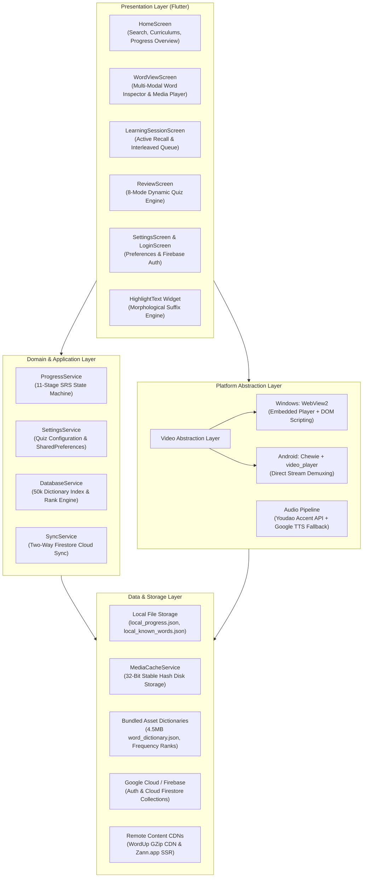

<div align="center">

# 🧠 WordDown

### *Intelligent, Multi-Modal Vocabulary Acquisition & Cognitive Spaced-Repetition Platform*

[](https://flutter.dev)
[](https://dart.dev)
[](https://firebase.google.com)
[](https://flutter.dev/multi-platform)
[](LICENSE)

<p align="center">
  <b>A production-grade, offline-first vocabulary mastery engine engineered with Flutter, combining an 11-stage Spaced Repetition System (SRS) with synchronized multimedia streaming, morphological text stemming, and real-time cloud synchronization.</b>
</p>

[Key Features](#-key-features) • [System Architecture](#-system-architecture) • [Engineering Highlights](#-deep-dive-engineering-highlights) • [Screenshots](#-application-preview) • [Getting Started](#-getting-started) • [Curriculums](#-curated-curriculums) • [Architecture Docs](docs/ARCHITECTURE.md)

</div>

---

## 📌 Overview

**WordDown** is a cross-platform vocabulary acquisition suite designed to bridge modern cognitive science with multi-modal digital media. Inspired by advanced language acquisition pedagogy, WordDown moves beyond rote flashcard memorization by immersing learners in **authentic real-world usage**: film/speech video clips synchronized to exact subtitle timestamps, historical quotes, lexical collocations, phonetic audio synthesis, and nuance discrimination cards.

Engineered with an analytical systems approach by an **Electrical & Telecommunications Engineering graduate**, the project features a resilient offline-first architecture, sub-millisecond memory-indexed search over 50,000+ words, a custom in-engine morphological regex stemmer, and an adaptive 11-step cognitive retention ladder based on the Ebbinghaus forgetting curve.

---

## ✨ Key Features

| Capability | Description |
|:---|:---|
| 🎬 **Multi-Modal Learning Pipeline** | Full word context cards featuring streaming video clips with millisecond-accurate subtitle sync, famous quote galleries with author portraits, nuance comparisons, common misspellings, idioms, and collocations. |
| 🧠 **11-Stage Spaced Repetition (SRS)** | Cognitive retention ladder scheduling reviews across expanding intervals ($1\text{d}, 2\text{d}, 3\text{d}, 4\text{d}, 7\text{d}, 14\text{d}, 30\text{d}, 60\text{d}, 90\text{d}, 180\text{d}, 365\text{d} \to \text{Mastered}$). |
| 🎯 **Dynamic 8-Mode Quiz Engine** | Algorithmic test generator supporting 8 active recall quiz styles: *Definition Matching, Quote Fill-in-the-Blank, Synonyms, Antonyms, Example Sentence Completion, Misspelling Detection, Audio Listening & Spelling, and Nuance Comparison*. |
| ⚡ **Morphological Stemmer & Hyperlinks** | Custom English inflection engine (`HighlightText`) that detects root words and morphological variants (`-ing`, `-ed`, `-ly`, `-tion`, `-ment`, consonant doubling, `y` $\to$ `i` transitions). Automatically turns in-definition vocabulary into clickable in-app links. |
| 🎧 **Dual-Engine Phonetic Audio** | Instant British (UK) and American (US) phonetic pronunciation via the Youdao Voice API with automated fallback to Google Translate TTS and local audio caching. |
| ☁️ **Offline-First & Cloud Firestore Sync** | Local-first JSON data persistence with two-way batched synchronization to Google Cloud Firestore. Supports seamless offline study with automated cloud reconciliation upon reconnection. |
| 📊 **Corpus Frequency Indexing** | Instantaneous prefix search over 50,000+ English words prioritized by real-world corpus frequency rankings. |
| 🎓 **Curated Academic & Domain Tracks** | Built-in word tracks for **GRE, TOEFL, IELTS, 1500 Essential Words, Idioms, Phrasal Verbs**, plus specialized technical tracks (**Electrical Engineering & Electronics**). |

---

## 📸 Application Preview

> *Place your application screenshots or recorded demo GIFs in an `assets/screenshots/` folder to display here.*

<div align="center">
<table>
  <tr>
    <td align="center" width="50%">
      <b>Explore & Frequency Search</b><br/>
      
    </td>
    <td align="center" width="50%">
      <b>Multi-Modal Word Inspector</b><br/>
      
    </td>
  </tr>
  <tr>
    <td align="center" width="50%">
      <b>Active Recall Learning Session</b><br/>
      
    </td>
    <td align="center" width="50%">
      <b>8-Mode Adaptive Quiz Engine</b><br/>
      
    </td>
  </tr>
</table>
</div>

---

## 🏗 System Architecture

WordDown follows a **Layered Service Architecture** with clean boundaries between UI Presentation, Domain Business Logic, Platform Abstraction, and Data Persistence.



> 📖 **Want a comprehensive architectural deep-dive?**  
> Check out the [System Architecture & Technical Specification Document](docs/ARCHITECTURE.md) covering state machine lifecycles, sequence diagrams, and mathematical scheduling formulations.

---

## 🔬 Deep-Dive Engineering Highlights

### 1. The 11-Stage Spaced Repetition (SRS) Engine
Human memory retention decays exponentially over time according to the Ebbinghaus forgetting curve. WordDown implements an adaptive 11-step ladder:
- **Interval Formula**: Reviews expand across exponential target steps: $0\text{d} \to 1\text{d} \to 2\text{d} \to 3\text{d} \to 4\text{d} \to 7\text{d} \to 14\text{d} \to 30\text{d} \to 60\text{d} \to 90\text{d} \to 180\text{d} \to 365\text{d} \to \text{Mastered}$.
- **Interleaved Sliding-Window Active Recall**: In `LearningSessionScreen`, words are not learned in isolation. The engine manages an active sliding window of 4 words, interleaving initial presentation with randomized recall checks before graduating words to the long-term review queue.
- **Graceful Demotion**: Failure at higher stages steps the user down to a lower reinforcement tier rather than resetting progress to zero, preserving learning investment while repairing memory traces.

### 2. Dual-Engine Cross-Platform Video Pipeline
Playing synchronized video clips across desktop and mobile required solving platform-specific codec and playback limitations:
- **Windows Desktop**: Employs Microsoft Edge WebView2 (`webview_windows`). Ingests stream URLs via `youtube_explode_dart` into an embedded hardware-accelerated HTML5 player with JavaScript script injection for ad/consent bypassing and timestamp seeking.
- **Android Mobile**: Employs `chewie` + `video_player` (ExoPlayer) with stream extraction, maintaining fluid 60fps rendering without WebViews.
- **Conditional Compilation**: Utilizes Dart conditional imports (`stubs/webview_windows_stub.dart`) to compile cleanly across platforms without leaking platform-specific native C++ libraries.

### 3. Morphological Stemming Engine (`HighlightText`)
Instead of embedding heavy native NLP models (like spaCy or NLTK) which would inflate mobile APK sizes, WordDown includes a custom rule-based morphological analyzer in Dart:
- Tokenizes sentences via regex and applies bidirectional inflection matching.
- Detects suffixes: `-s`, `-es`, `-d`, `-ed`, `-ing`, `-ly`, `-ment`, `-tion`, `-er`, `-est`.
- Handles geminate consonant doubling (`run` $\to$ `running`) and consonant elisions (`create` $\to$ `creating`, `happy` $\to$ `happier`).
- Cross-references tokens against the user's active learning queue in real time, rendering clickable `TextSpan` hyperlinks for seamless contextual navigation.

### 4. Deterministic 32-Bit Stable Hash Caching
Dart's built-in `String.hashCode` randomizes its seed per process invocation to protect against collision attacks, making it unusable for cross-session disk cache keying. WordDown implements a deterministic **32-bit polynomial rolling hash**:

$$H = \left( \sum_{i=0}^{L-1} s[i] \cdot 31^{L-1-i} \right) \pmod{2^{32}}$$

This guarantees identical cache file resolution across application restarts, app updates, and operating system reboots.

### 5. Resilient Multi-Tier Ingestion & Decompression
- **GZip Stream Decompression**: Consumes binary gzip-compressed payloads (`.gz`) from remote CDNs on the fly using `archive/archive.dart`, slashing data transfer overhead by $>70\%$.
- **SSR Next.js Hydration Scraping**: Enriches dictionary entries by parsing Next.js `__NEXT_DATA__` JSON hydration scripts from `zann.app` to supply high-resolution author portraits, curated quotes, and senses.

### 6. Batched Cloud Synchronization & Socket Protection
When synchronizing extensive vocabulary lists with **Google Cloud Firestore**, issuing hundreds of unbounded concurrent HTTP/2 requests leads to mobile thermal throttling and socket exhaustion. `SyncService` implements a **batching window of 20 concurrent futures**, balancing maximum throughput with socket stability.

---

## 🛠 Tech Stack & Dependencies

| Area | Technology / Library | Purpose |
|:---|:---|:---|
| **Framework** | [Flutter 3.x](https://flutter.dev) (Dart 3.x) | Cross-platform client UI |
| **Design System** | Material 3 + Google Fonts (`Outfit`) | Dark-themed slate & indigo user interface |
| **Cloud & Auth** | Firebase Core, Firebase Auth, Cloud Firestore | Anonymous & email auth, cloud synchronization |
| **Media & Audio** | `audioplayers`, `video_player`, `chewie` | Mobile media playback and phonetic pronunciation |
| **Desktop Web** | `webview_windows` | Hardware-accelerated desktop video player |
| **Stream Extraction** | `youtube_explode_dart` | Direct YouTube stream demuxing & metadata parsing |
| **Decompression** | `archive` (`GZipDecoder`) | Decompressing remote `.gz` dictionary payloads |
| **Local Storage** | `shared_preferences`, `path_provider` | User settings, documents directory cache |

---

## 📚 Curated Curriculums

WordDown comes pre-loaded with curated, structured word lists indexed against real-world frequency:

- 🎯 **1500 Essential Words**: High-frequency foundation vocabulary.
- 🎓 **GRE Vocabulary**: Advanced academic and analytical words for graduate exams.
- 📝 **TOEFL Vocabulary**: Academic English for international university admissions.
- 🌐 **IELTS Vocabulary**: Core lexical resource band-boosters.
- 💬 **Idioms & Phrasal Verbs**: Essential figurative expressions and natural collocations.
- ⚡ **Electrical Engineering & Electronics**: Specialized domain-specific vocabulary for engineering scholars and telecom researchers.

---

## 📂 Project Structure

```
worddown/
├── assets/
│   ├── data/
│   │   └── frequency_ranking.json   # 50,000+ word frequency rank index
│   ├── lists/                       # Curated academic & domain curriculum JSONs
│   │   ├── GRE.json, TOEFL.json, IELTS.json, 1500_Essential_Words.json
│   │   ├── Electrical_Engineering.json, Electronics.json
│   │   └── Idioms.json, Phrasal_Verbs.json
│   ├── sounds/                      # SFX for correct, fail, success, finish
│   └── word_dictionary.json         # Complete 4.5MB core dictionary lookup
├── docs/
│   └── ARCHITECTURE.md              # Technical specification & system design doc
├── lib/
│   ├── main.dart                    # Application entrypoint & theme configuration
│   ├── firebase_options.dart        # FlutterFire generated platform configurations
│   ├── models/
│   │   └── word.dart                # WordData, WordSense, WordVideo, WordQuote models
│   ├── screens/
│   │   ├── home_screen.dart         # Explore, curriculum browsing & frequency search
│   │   ├── word_view_screen.dart    # Multi-modal inspector, video player & media tabs
│   │   ├── learning_session_screen.dart # Interleaved active-recall study session
│   │   ├── review_screen.dart       # 8-mode dynamic quiz & review engine
│   │   ├── word_list_screen.dart    # Filtered word list views (Known / Learning)
│   │   ├── settings_screen.dart     # Question preferences & account controls
│   │   └── login_screen.dart        # Firebase authentication interface
│   ├── services/
│   │   ├── database_service.dart    # In-memory dictionary index & search algorithms
│   │   ├── progress_service.dart    # 11-stage SRS state machine & file persistence
│   │   ├── sync_service.dart        # Batched two-way Cloud Firestore synchronization
│   │   ├── wordup_api.dart          # CDN GZip ingestion, SSR scraping & TTS routing
│   │   ├── media_cache_service.dart # Deterministic 32-bit stable hash disk cache
│   │   └── settings_service.dart    # SharedPreferences quiz toggles
│   ├── stubs/
│   │   └── webview_windows_stub.dart# Cross-platform compilation bridge for non-Windows
│   └── widgets/
│       └── highlight_text.dart      # Custom morphological stemming & clickable TextSpans
├── pubspec.yaml                     # Dependencies & asset declarations
└── README.md
```

---

## 🚀 Getting Started

### Prerequisites
- [Flutter SDK](https://docs.flutter.dev/get-started/install) (`^3.12.2` or later)
- [Dart SDK](https://dart.dev/get-dart)
- For Windows Desktop: Visual Studio 2022 with **Desktop development with C++**
- For Android: Android Studio with Android SDK and Emulator / Physical Device

### 1. Clone the Repository
```bash
git clone https://github.com/your-username/worddown.git
cd worddown
```

### 2. Install Dependencies
```bash
flutter pub get
```

### 3. Configure Firebase
WordDown uses Firebase for authentication and progress synchronization.
1. Install the FlutterFire CLI:
   ```bash
   dart pub global activate flutterfire_cli
   ```
2. Configure your Firebase project:
   ```bash
   flutterfire configure
   ```
   *(Ensure Cloud Firestore and Firebase Authentication [Anonymous & Email/Password providers] are enabled in your Firebase Console).*

### 4. Run the Application

#### On Windows Desktop:
```bash
flutter run -d windows
```

#### On Android Device / Emulator:
```bash
flutter run -d android
```

---

## 👨‍💻 Author & Contact

**Developed by an Electrical & Telecommunications Engineering Graduate**  
Passionate about high-performance software engineering, algorithmic efficiency, and cross-platform systems development.

- 💼 **LinkedIn**: [linkedin.com/in/your-profile](https://linkedin.com/in/your-profile)
- 🐙 **GitHub**: [@your-username](https://github.com/your-username)
- 📧 **Email**: [your.email@example.com](mailto:your.email@example.com)

---

## 📄 License

This project is licensed under the **MIT License** — see the [LICENSE](LICENSE) file for details.
