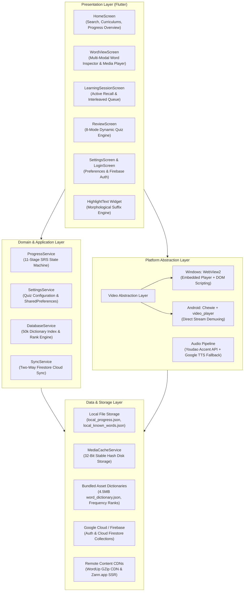
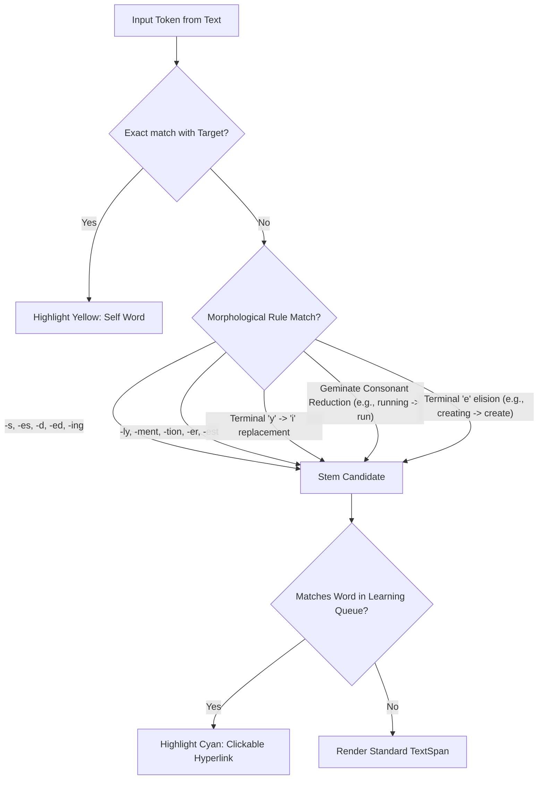
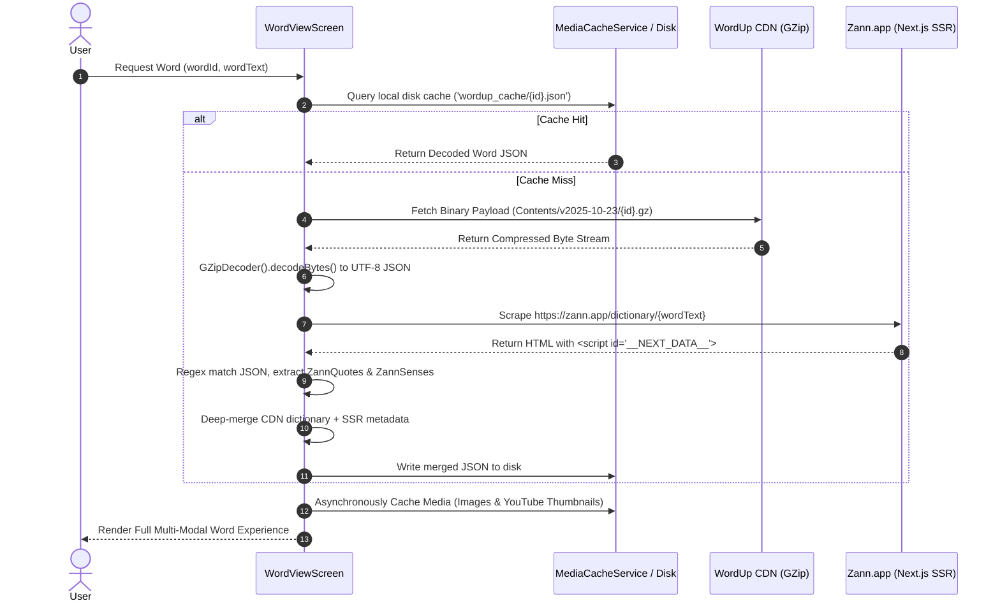
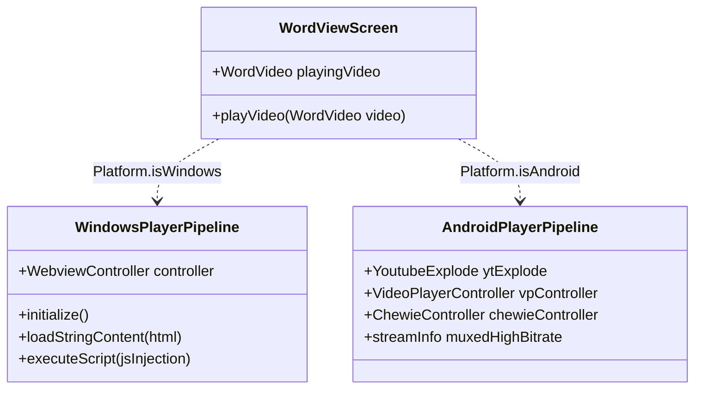

# WordDown System Architecture & Technical Specification

> **Engineering Design Document**  
> **Platform**: Flutter (Cross-Platform Windows Desktop & Android Mobile)  
> **Backend**: Firebase Authentication & Cloud Firestore  
> **Author**: Electrical & Telecommunications Engineering Graduate  

---

## 1. Executive Summary

**WordDown** is an offline-first, multi-modal vocabulary acquisition and cognitive spaced-repetition platform built in **Flutter/Dart**. It bridges complex multimedia content (synchronized video timestamp streams, phonetic audio synthesis, author quote galleries, and lexical collocations) with an **11-stage Spaced Repetition (SRS)** cognitive retention engine.

The platform is designed to operate seamlessly across high-performance desktop environments (Windows) and resource-constrained mobile devices (Android), utilizing conditional compilation, platform-specific media pipelines, resilient multi-tier caching, and asynchronous cloud synchronization.

---

## 2. High-Level System Architecture

WordDown is structured around a **Layered Service Architecture** with strict separation between Presentation, Application/Domain Logic, Platform Abstraction, and Data Persistence.



---

## 3. Core Architectural Subsystems

### 3.1. 11-Stage Spaced Repetition System (SRS)

Human memory decay follows the **Ebbinghaus Forgetting Curve**. WordDown implements an adaptive 11-step cognitive retention ladder where successful active recall expands the review interval exponentially.

$$\Delta t_{n} = \text{Interval}(\text{Step}_n)$$

#### Interval Ladder Progression Table:
| Step | Interval | Cognitive Stage | Action on Success | Action on Failure |
|:---:|:---|:---|:---:|:---:|
| **0** | $0\text{ days}$ | Learning Queue / Newly Introduced | Advance to Step 1 | Stay in Step 0 |
| **1** | $1\text{ day}$ | Initial Consolidation | Advance to Step 2 | Reset to Step 0 |
| **2** | $2\text{ days}$ | Short-Term Retention | Advance to Step 3 | Reset to Step 0 |
| **3** | $3\text{ days}$ | Early Recall | Advance to Step 4 | Reset to Step 0 |
| **4** | $4\text{ days}$ | Reinforcement | Advance to Step 5 | Reset to Step 0 |
| **5** | $7\text{ days}$ (1 week) | Intermediate Memory | Advance to Step 6 | Step down to Step 3 |
| **6** | $14\text{ days}$ (2 weeks) | Stable Memory | Advance to Step 7 | Step down to Step 4 |
| **7** | $30\text{ days}$ (1 month) | Long-Term Transfer | Advance to Step 8 | Step down to Step 5 |
| **8** | $60\text{ days}$ (2 months) | Deep Consolidation | Advance to Step 9 | Step down to Step 6 |
| **9** | $90\text{ days}$ (3 months) | Permanent Trace | Advance to Step 10 | Step down to Step 7 |
| **10** | $180\text{ days}$ (6 months) | High Mastery | Advance to Step 11 | Step down to Step 8 |
| **11** | $365\text{ days}$ (1 year) | Ultimate Retention | **Mastered / Known** | Step down to Step 9 |

#### Due Calculation Algorithm:
A word is marked due for testing when the system time satisfies:
```dart
bool isDue(WordProgress progress) {
  return DateTime.now().isAfter(progress.practiceDue);
}
```

#### Active Recall Interleaving Engine:
During a `LearningSessionScreen` run, new words are not simply reviewed sequentially. Instead, an **interleaved sliding-window queue** of maximum 4 words is maintained:
1. The user inspects the multi-modal card for Word $A$.
2. Word $A$ is pushed to an active testing queue.
3. The system presents Words $B$, $C$, and $D$.
4. Word $A$ resurfaces as an active recall quiz.
5. If answered correctly, it **graduates** into Step 1 of the SRS ladder; if failed, it re-enters the tail of the study queue.

---

### 3.2. Morphological Suffix & Stemming Engine (`HighlightText`)

To provide contextual immersion without external heavy NLP libraries, WordDown implements a custom, deterministic morphological matcher in `widgets/highlight_text.dart`.

When rendering word definitions, example sentences, or quote excerpts, the engine scans the text using tokenizing regex `[a-zA-Z']+` and evaluates bidirectional morphological transformations:



- **Interactive Hyperlinks**: Tapping any cyan-highlighted token dispatches an in-app navigation event pushing `WordViewScreen` for that word onto the navigator stack, enabling recursive vocabulary exploration.

---

### 3.3. Multi-Tier Content Acquisition & Caching Pipeline

To maintain zero-latency responsiveness and low bandwidth consumption, data acquisition is tiered:



#### Stable Hash Asset Deduplication:
Dart's default `String.hashCode` is randomized per process invocation for hash-flooding security. For persistent disk caching across app restarts, WordDown implements a **deterministic 32-bit polynomial rolling hash**:

$$H = \left( \sum_{i=0}^{L-1} s[i] \cdot 31^{L-1-i} \right) \pmod{2^{32}}$$

```dart
int stableHash = 0;
for (int i = 0; i < url.length; i++) {
  stableHash = 31 * stableHash + url.codeUnitAt(i);
  stableHash = stableHash & 0xFFFFFFFF;
}
```
This guarantees consistent filenames formatted as `${stableHash}_${sanitizedFileName}` across sessions.

---

### 3.4. Dual-Engine Cross-Platform Media Pipeline

Handling high-fidelity media across both Windows and Android requires different architectural approaches:



#### Windows Desktop Pipeline:
- **Component**: `webview_windows` (Chromium / Microsoft Edge WebView2).
- **Technique**: Stream URLs extracted via `youtube_explode_dart` are loaded into an inline HTML5 video player with auto-seek (`video.currentTime = startSec`).
- **Resilience Fallback**: If direct stream extraction is rate-limited, the WebView loads the standard YouTube URL and injects JavaScript to bypass cookie consent banners, hide redundant UI elements, and pin the video element full-frame.
- **Conditional Compilation**: On non-Windows platforms, a custom stub `stubs/webview_windows_stub.dart` satisfies the Dart compiler without bundling native Windows C++ bindings.

#### Android Mobile Pipeline:
- **Component**: `video_player` + `chewie` (ExoPlayer under the hood).
- **Technique**: Direct demuxing of YouTube muxed streams via `youtube_explode_dart`. Seek operations execute natively via `vpController.seekTo(Duration(milliseconds: startMs))`.
- **Resource Management**: Video controllers and audio streams are systematically disposed in `dispose()` to prevent memory leaks and thread exhaustion.

---

### 3.5. Two-Way Asynchronous Cloud Synchronization

The synchronization layer in `services/sync_service.dart` ensures full offline functionality while maintaining eventual consistency with **Google Cloud Firestore**.

#### Firestore Data Model:
```
users/
 └── {uid}/
      ├── progressMap/
      │    └── {wordId}: { WordId: int, RememberCount: int, PracticeDue: ISO8601 }
      ├── knownWords/
      │    └── {wordId}: { addedAt: Timestamp }
      ├── queuedWords/
      │    └── {wordId}: { addedAt: Timestamp }
      └── preferredImages/
           └── {wordId}: { imageUrl: string }
```

#### Batching & Socket Preservation:
To prevent socket starvation, network timeouts, or thermal throttling on mobile devices when synchronizing hundreds of vocabulary entries, uploads are processed in deterministic concurrent batches:
```dart
const batchSize = 20;
for (var i = 0; i < uploadTasks.length; i += batchSize) {
  final end = (i + batchSize < uploadTasks.length) ? i + batchSize : uploadTasks.length;
  final batch = uploadTasks.sublist(i, end).map((f) => f());
  await Future.wait(batch);
}
```

---

## 4. Engineering Trade-offs & Design Decisions

| Decision | Alternative Evaluated | Chosen Approach | Rationale |
|:---|:---|:---|:---|
| **Dictionary Index** | SQLite database file | In-memory JSON mapping (`assets/word_dictionary.json`, 4.5MB) | Instant $O(1)$ key lookup for 50,000+ words; avoids native SQLite dynamic linking overhead across Windows & Android platforms. |
| **Video Playback on Desktop** | Embedded VLC player / native plugins | Microsoft Edge WebView2 (`webview_windows`) | Native Windows video player plugins frequently crash with YouTube codecs; WebView2 provides hardware acceleration and Chromium sandboxing. |
| **Stemming Engine** | Full Porter-Stemmer / Python spaCy backend | In-engine Dart Morphological Regex Stemmer | Zero network latency during UI rendering; avoids packaging heavy C/C++ or Python dependencies on mobile devices. |
| **Offline State** | Cloud-first with local cache | Local-first JSON with asynchronous Firestore sync | The user can study uninterrupted on airplanes or unstable mobile networks; sync reconciliation occurs automatically upon reconnection. |

---

## 5. Security & Data Integrity

- **Anonymous to Permanent Authentication**: Users begin immediately with Firebase Anonymous Authentication. When they choose to register via email/password in `LoginScreen`, Firebase seamlessly links their local progress records to their cloud UID.
- **Safe JSON Deserialization**: All parsing routines use null-safe defaults (`?? ''`, `?? 0`) preventing unhandled exceptions from malformed network responses.
- **Path Confinement**: Dynamic disk file writes are strictly confined to `getApplicationDocumentsDirectory()`, complying with Android Scoped Storage and Windows User Data sandboxing.
