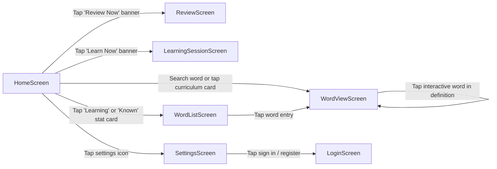

# WordDown Codebase Map & Technical Reference 🗺️

> **Developer & AI Model Context Guide**  
> This document provides an exhaustive structural map of the WordDown codebase to enable rapid feature development, bug fixing, and context-aware pair-programming for software engineers and AI coding agents.

---

## 1. Directory Structure

```
worddown/
├── assets/                          # Bundled static assets
│   ├── data/
│   │   └── frequency_ranking.json   # JSON array of word IDs sorted by usage frequency
│   ├── lists/                       # Curated curriculum JSON word lists
│   │   ├── 1500_Essential_Words.json
│   │   ├── Electrical_Engineering.json
│   │   ├── Electronics.json
│   │   ├── GRE.json
│   │   ├── IELTS.json
│   │   ├── Idioms.json
│   │   ├── Phrasal_Verbs.json
│   │   └── TOEFL.json
│   ├── sounds/                      # SFX assets (correct.wav, wrong.wav, success.mp3, etc.)
│   └── word_dictionary.json         # 4.5MB main word dictionary [ { "i": id, "w": word, "m": meaning } ]
├── docs/                            # Developer, architecture, and AI documentation
│   ├── ARCHITECTURE.md              # Detailed system architecture specification
│   ├── CODEBASE_MAP.md              # This file (file tree, models, services, recipes)
│   ├── DEVELOPER_GUIDE.md           # Build steps, release invariants, and toolchain setup
│   └── README.md                    # Documentation index
├── lib/                             # Application source code
│   ├── firebase_options.dart        # Platform-specific Firebase options
│   ├── main.dart                    # App bootstrap & Theme configuration
│   ├── models/                      # Domain data models
│   │   └── word.dart                # WordData, WordSense, WordVideo, WordQuote, WordPhrase
│   ├── screens/                     # UI screens
│   │   ├── home_screen.dart         # Frequency search, curriculum browser & stat cards
│   │   ├── learning_session_screen.dart # Interleaved active recall study session
│   │   ├── login_screen.dart        # Firebase authentication (Email/Password & Anonymous)
│   │   ├── review_screen.dart       # 8-mode adaptive quiz & review engine
│   │   ├── settings_screen.dart     # Account controls & quiz question type toggles
│   │   ├── word_list_screen.dart    # Filtered word lists (Learning vs Known)
│   │   └── word_view_screen.dart    # Multi-modal word inspector & video player
│   ├── services/                    # Business logic & singleton services
│   │   ├── database_service.dart    # In-memory dictionary index & search algorithms
│   │   ├── firebase_service.dart    # Anonymous auth bootstrap
│   │   ├── media_cache_service.dart # 32-bit stable hash disk cache for images/thumbnails
│   │   ├── progress_service.dart    # 11-stage SRS state machine & local JSON persistence
│   │   ├── settings_service.dart    # SharedPreferences preferences for quiz toggles
│   │   ├── sync_service.dart        # Batched two-way Cloud Firestore synchronization
│   │   └── wordup_api.dart          # Remote lexical CDN GZip fetcher & SSR scraper
│   ├── stubs/                       # Cross-platform compilation stubs
│   │   └── webview_windows_stub.dart# No-op stub for webview_windows on Android/iOS/Web
│   └── widgets/                     # Reusable UI components
│       └── highlight_text.dart      # Morphological stemming & clickable TextSpan generator
├── releases/                        # Packaged release bundles
│   ├── Android/                     # WordDown_Android.zip and app-release.apk
│   └── Windows/                     # WordDown_Windows.zip
├── pubspec.yaml                     # Dependencies and asset registrations
└── README.md                        # User-facing frontpage
```

---

## 2. Core Domain Models (`lib/models/word.dart`)

| Model | Fields | Purpose |
|:---|:---|:---|
| `DictWord` | `id`, `text`, `meaning` | Lightweight dictionary entry loaded into memory at launch for fast search and autocomplete. |
| `WordSense` | `id`, `de`, `ex`, `ty`, `sy`, `op`, `tips`, `imageUrl` | A single definition/sense of a word with example sentence, part of speech, synonyms, antonyms, and memory tips. |
| `WordTip` | `title`, `description`, `example`, `imageUrl` | Mnemonic tip or usage note associated with a sense. |
| `WordQuote` | `authorName`, `authorRole`, `text`, `imageUrl` | Real-world quote from a historical or notable figure using the target word. |
| `WordVideo` | `title`, `subtitles`, `youtubeId`, `startTimeMs` | Short YouTube video excerpt with exact timestamp offset and cleaned subtitle text. |
| `WordComparison` | `word`, `text` | Nuance distinction comparing the target word against an easily confused word. |
| `WordPhrase` | `doText`, `de`, `ex`, `ty` | Collocations, compounds, and idioms containing the word. |
| `WordData` | `wordId`, `senses`, `quotes`, `videos`, `comparisons`, `usage`, `wisdom`, `facts`, `collocations`, `misspellings`, `phrases`, `compounds`, `imageUrl` | The full, multi-modal payload loaded dynamically when inspecting a word card. |
| `WordProgress` | `wordId`, `rememberCount`, `practiceDue` | Progress tracking state representing the word's position on the 11-step SRS ladder. |

---

## 3. Singleton Services Layer (`lib/services/`)

### `DatabaseService` (`database_service.dart`)
- Loads `assets/word_dictionary.json` (4.5MB) into a `Map<int, DictWord>` and `List<DictWord>` during startup.
- Loads `assets/data/frequency_ranking.json` to assign an integer rank to each word.
- Exposes `searchWords(query)`: Prefix matches sorted by frequency rank, capped at 50 results for instant typing response.
- Exposes `getCurriculum(name)`: Reads comma-separated IDs from `assets/lists/<name>.json` and returns the resolved `List<DictWord>`.

### `ProgressService` (`progress_service.dart`)
- Manages the **11-step Spaced Repetition (SRS) ladder**:
  ```dart
  final List<Duration> stepIntervals = [
    Duration(days: 0),   // Step 0: Learning queue
    Duration(days: 1),   // Step 1: 1 day
    Duration(days: 2),   // Step 2: 2 days
    Duration(days: 3),   // Step 3: 3 days
    Duration(days: 4),   // Step 4: 4 days
    Duration(days: 7),   // Step 5: 1 week
    Duration(days: 14),  // Step 6: 2 weeks
    Duration(days: 30),  // Step 7: 1 month
    Duration(days: 60),  // Step 8: 2 months
    Duration(days: 90),  // Step 9: 3 months
    Duration(days: 180), // Step 10: 6 months
    Duration(days: 365), // Step 11: 1 year (Mastery)
  ];
  ```
- Local file persistence:
  - `local_progress.json`: Stores `Map<int, WordProgress>`
  - `local_known_words.json`: Stores `Set<int>` of mastered words
  - `local_to_learn.json`: Stores `Set<int>` of queued words
  - `local_preferred_images.json`: Stores user-selected image overrides
- Exposes:
  - `dueWords`: Words where `practiceDue <= DateTime.now()`
  - `recordAnswer(wordId, isCorrect)`: Advances or demotes the word along the ladder
  - `markAsKnown(wordId)`: Advances immediately to mastered state
  - `addWordToLearn(wordId)`: Places word into learning queue

### `SyncService` (`sync_service.dart`)
- Listens to `FirebaseAuth.instance.authStateChanges()`.
- On user login, executes `_syncDown(uid)`:
  - Fetches cloud collections: `progressMap`, `knownWords`, `queuedWords`, `preferredImages`.
  - Merges with local records and uploads un-synced local data to the cloud in batches of 20 concurrent futures.
- Exposes `pushProgress`, `pushKnownWord`, `pushQueuedWord`, and `pushPreferredImage`.

### `MediaCacheService` (`media_cache_service.dart`)
- Implements a deterministic **32-bit polynomial rolling hash** on URLs to avoid Dart's randomized `String.hashCode` across restarts.
- Caches images, portraits, and YouTube video thumbnail files in `wordup_cache/{wordId}/`.

### `WordupApi` (`wordup_api.dart`)
- Multi-tier lexical data ingestion:
  1. Memory cache (for Web)
  2. Local disk file cache (`wordup_cache/{wordId}.json`)
  3. Remote CDN binary download (`{wordId}.gz`), decompressed using `GZipDecoder`
  4. Web scraping of Next.js hydration payload (`__NEXT_DATA__`) to merge rich author portraits and quotes
- Exposes `getAudioPath`: Resolves audio pronunciation via the Youdao voice API (UK type=1, US type=2) with automatic fallback to Google Translate TTS.

### `SettingsService` (`settings_service.dart`)
- Backed by `SharedPreferences`.
- Controls toggles for the 8 review question types (`enableMeaningQuestion`, `enableQuoteQuestion`, `enableSynonymQuestion`, etc.).

---

## 4. UI Components & Screen Navigation



### `HighlightText` Widget (`lib/widgets/highlight_text.dart`)
- Inspects text token-by-token using `RegExp(r"[a-zA-Z']+")`.
- Performs **bidirectional morphological stem matching**:
  - Regular suffixes: `-s`, `-es`, `-d`, `-ed`, `-ing`, `-ly`, `-ment`, `-tion`, `-er`, `-est`
  - Consonant doubling: `run` $\leftrightarrow$ `running`
  - Terminal vowel elision: `create` $\leftrightarrow$ `creating`, `wide` $\leftrightarrow$ `widest`
  - Terminal mutation: `happy` $\leftrightarrow$ `happier`, `carry` $\leftrightarrow$ `carries`
- Styling:
  - Target word itself: Rendered in **Yellow Accent**.
  - Any word present in the user's active learning queue: Rendered in **Cyan Accent** and wrapped in a `TapGestureRecognizer` that pushes a new `WordViewScreen`.

---

## 5. Developer Recipes (How to Extend WordDown)

### Recipe 1: Adding a New Curriculum List
1. Create a JSON file in `assets/lists/<Curriculum_Name>.json`:
   ```json
   {
     "uw": "12,45,78,92,105"
   }
   ```
   *(A comma-separated string of word IDs).*
2. Open `lib/services/database_service.dart`.
3. Add the new curriculum filename (without `.json`) to `availableCurriculums`:
   ```dart
   static final List<String> availableCurriculums = [
     '1500_Essential_Words',
     'Electrical_Engineering',
     'Electronics',
     'GRE',
     'IELTS',
     'Idioms',
     'Phrasal_Verbs',
     'TOEFL',
     'Your_New_Curriculum' // <--- Add here
   ];
   ```
4. Register the asset in `pubspec.yaml` (if not already covered by `assets/lists/`).

---

### Recipe 2: Adding a New Question Type to `ReviewScreen`
1. Open `lib/services/settings_service.dart`:
   - Add a new boolean toggle (e.g. `enableCollocationQuestion = true;`).
   - Add getter and setter saving to `SharedPreferences`.
2. Open `lib/screens/settings_screen.dart`:
   - Add a `SwitchListTile` in the practice preferences section.
3. Open `lib/screens/review_screen.dart`:
   - In `_generateQuestion()`, add the condition:
     ```dart
     if (settings.enableCollocationQuestion && data != null && data.collocations.isNotEmpty) {
       availableTypes.add('collocation');
     }
     ```
   - In `_loadNextWord()`, handle the UI rendering and distractors generation for `'collocation'`.

---

### Recipe 3: Adjusting Spaced Repetition (SRS) Intervals
1. Open `lib/services/progress_service.dart`.
2. Locate `final List<Duration> stepIntervals = [...]`.
3. Modify the durations for any step. For example, to make Step 1 trigger after 12 hours instead of 1 day:
   ```dart
   const Duration(hours: 12), // Step 1
   ```
4. All due calculations automatically reflect the updated intervals.
